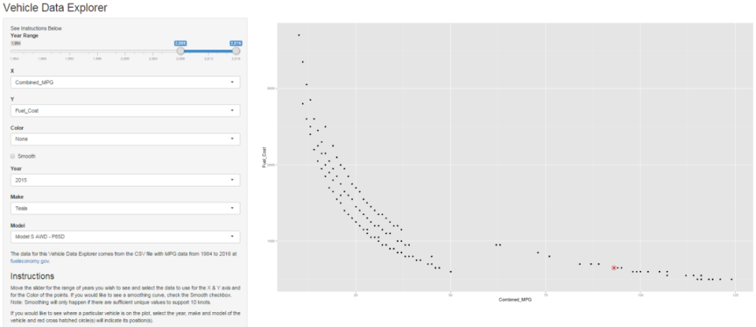

## Introduction

* Are you deciding on what new vehicle to purchase?
* Do you want to know more about how your current vehicle compares to others?
* Purchase price is only part of the Total Cost of Ownership. What about fuel cost which could be 50% or more of the purchase price over the life of the vehicle?
* What is your vehicle's carbon footprint?

### [Vehicle Data Explorer](https://joebragg.shinyapps.io/DataProduct/) can help answer these questions.


--- .class #id 

## Screen Shot



---
## The Data

The data for the Vehicle Data Explorer comes from the U.S. Department of Energy website [fueleconomy.gov](http://www.fueleconomy.gov/). It includes vehicle data from 1984 to 2016.


```r
vehicle.data<-read.csv("../data/vehicles.csv")
numMM<-length(unique(paste(vehicle.data$make,vehicle.data$model)))
numMM
```

[1] 3436

```r
numYMM<-length(unique(paste(vehicle.data$year,vehicle.data$make,vehicle.data$model)))
numYMM
```

[1] 15553

This data includes 3436 makes & models across 32 years for a total of 15553 vehicles.

---
## Future Development

This [Shiny](http://shiny.rstudio.com/) web application is a work in progress. You are welcome to fork the [Github repository](https://github.com/joebragg/DataProducts.git) and contribute to its development. Here are a few ideas for your consideration.

* Add a selection of visualizations to assist with exploration of the data including bar charts, bubble charts, box plots, etc.
* Incorporate additional data sets such as safety ratings, recall information, consumer ratings and Total Cost of Ownership
* Data collection on the types of data and visualizations that consumers use the most on the site

### Informed consumers are key to future progress and a better World!!!


